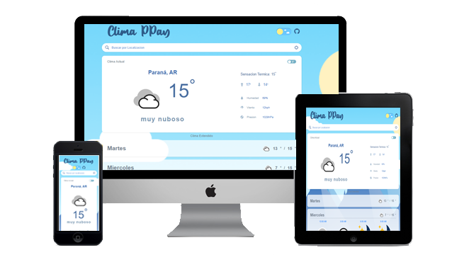
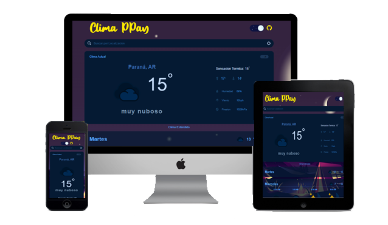

# React Clima PPAY - Challenge

[**DEMO**](https://ppay-weather.vercel.app/)

**Weather PPAY** es una aplicacion de clima para obtener la informacion detallada por dia y hora utilizando las api **OpenWeather Api**. Permite cambiar el sistema de medicion de grados celsius a fahrenheit. La aplicacion esta disponible en **light** y **dark mode**.

#### Light mode



#### Dark mode



## Libraries

- [React](https://github.com/facebook/react)
- [react-redux](https://github.com/react-redux) (State and dispatch)
- [Axios](https://github.com/axios/axios) (API Calls)
- [styled-components](https://github.com/) (Styles)
- [react-toastify](https://github.com/) (Error message box)
- [react-debounce-input](https://github.com/) (autofill)
- [react-dark-mode-toggle](https://github.com) (mode)
- [prettier](https://github.com) (format)
- [eslint](https://github.com) (validation)

## Setup

Cree un archivo llamado **.env** en la raíz del proyecto. Agregue el siguiente código en el archivo.

```
REACT_APP_WEATHER_API_KEY=3408878d6e2171e6ca8c87357c08b56f
```

La aplicación utiliza **One Call API** de OpenWeather API. Para iniciar el proyecto, necesita una **cuenta** y una **clave API de OpenWeather**. Puede registrarse y obtener la clave desde [aquí] (https://openweathermap.org/api).

## OTHERS

Esta aplicacion web es responsive.
